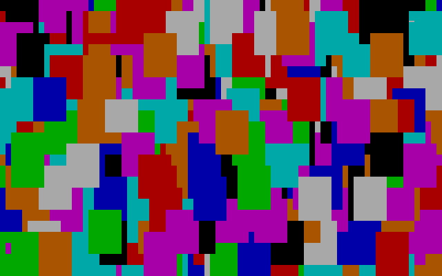

# my-first-programs

Here are my very first BASIC and Pascal programs, which I wrote when I was about 13 years old.

---
## [CALC.BAS](BASIC/CALC.BAS)

---
## [CIRCLE_1.BAS](BASIC/CIRCLE_1.BAS)

---
## [CIRCLE_2.BAS](BASIC/CIRCLE_2.BAS)

---
## [PAINT.BAS](BASIC/PAINT.BAS)

---
## [QUAD_EQ.BAS](BASIC/QUAD_EQ.BAS)

---
## [RADAR.BAS](BASIC/RADAR.BAS)

---
## [TUBE_1.BAS](BASIC/TUBE_1.BAS)

---
## [TUBE_2.BAS](BASIC/TUBE_2.BAS)

---
## [TONEL.BAS](BASIC/TONEL.BAS)

---
## [PYRAMID.BAS](BASIC/PYRAMID.BAS)

---
## [X_FILES.BAS](BASIC/X_FILES.BAS)

---
## [EXPONENT.BAS](BASIC/EXPONENT.BAS)

---
## [BALL.BAS](BASIC/BALL.BAS)

---
## [RANDOM.PAS](PASCAL/RANDOM.PAS)

---
## [CALC.PAS](PASCAL/CALC.PAS)

---
## [FAN.PAS](PASCAL/FAN.PAS)

---
## [BOXES_3D.PAS](PASCAL/BOXES_3D.PAS)

---
## [RECUR_1.PAS](PASCAL/RECUR_1.PAS)

---
## [RECUR_2.PAS](PASCAL/RECUR_2.PAS)

---
## [RECUR_3.PAS](PASCAL/RECUR_3.PAS)

---
## [SNOW.PAS](PASCAL/SNOW.PAS)

---
## [VisualBasic/Calendar](VisualBasic/Calendar)

---
## [VisualBasic/GLText](VisualBasic/GLText)

